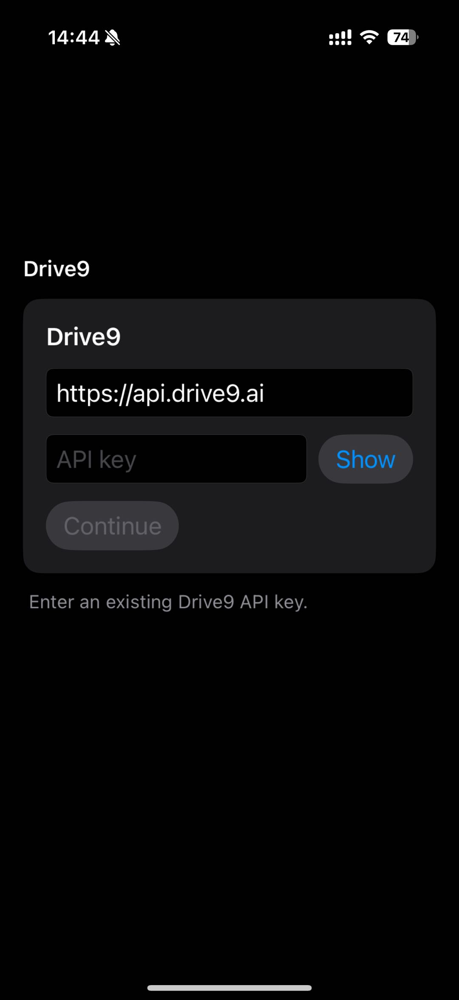
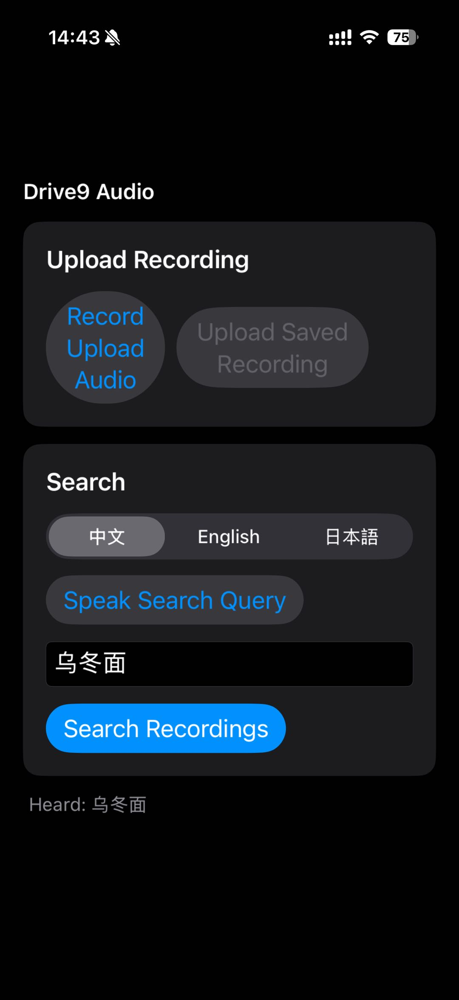
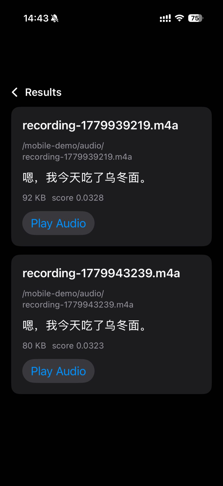

# iOS Drive9 Example

SwiftUI demo for the Drive9 Swift SDK.

## Setup

1. Clone the latest native SDK source:

```bash
../scripts/bootstrap-drive9-sdk.sh
```

2. Open `Drive9Example/Drive9Example.xcodeproj`.

The Xcode project already references the local Swift package at:

```text
../../vendor/drive9/clients/drive9-swift
```

If you use a different checkout, update the local package path in Xcode or set
up `vendor/drive9` with the bootstrap script.

The Swift SDK is a native HTTP implementation. No Rust build, UniFFI generation,
C bridge, shared library, linker flag, or `DYLD_LIBRARY_PATH` is needed.

The SDK package and this example target are configured for iOS 17 or newer.

## Usage

Enter the Drive9 base URL and an existing Drive9 API key/token. The default
server is `https://api.drive9.ai`.

The main screen has two workflows:

- Record audio and upload it to `/mobile-demo/audio`.
- Pick a language (中文 / English / 日本語), speak a search query, and search
  `/mobile-demo/audio`. Transcription uses Apple's `SFSpeechRecognizer`
  on-device when the locale's offline model is installed, otherwise it falls
  back to Apple's online speech service. The transcribed query is sent to
  the existing Drive9 `grep` endpoint.

The transcribed query is shown in an editable text field so you can fix any
recognition mistakes before tapping Search Recordings.

Search results open in a read-only list with name, path, the Drive9-extracted
semantic summary, size, match score, and a play button that downloads and
plays the matching audio file.

Drive9 indexes uploaded recordings asynchronously on the backend, so a freshly
uploaded clip becomes searchable - and gains its semantic summary - after the
server finishes processing it.

## Manual

### 1. Login with Drive9 API Key

Run `cat ~/.drive9/config` in your drive9 host, and you'll see the following content.

```json
{
  "server": "https://api.drive9.ai",
  "current_context": "dev",
  "contexts": {
    "dev": {
      "type": "owner",
      "server": "https://api.drive9.ai",
      "api_key":"dat9_...",
      "expires_at": "..."
    }
  }
}
```

Copy and paste the `api_key` into the application.



### 2. Upload recording.

**Upload the recording by following these steps:**

1. Tap **"Record Upload Audio"** to start recording.
2. Tap **"Stop Upload Recording"** to stop recording; the recording will be generated at this point.
3. Tap **"Upload Saved Recording"** to upload the recording to Drive9.

**Search for the recording by following these steps:**
1. Tap **"Speak Search Query"** to start recording your search query.
2. Tap **"Stop Speaking"** to end the recording.
3. Tap **"Search Recordings"** to find the related recording from Drive9.



### 3. Searching Result.

This page will display all the results, and you can also replay the original audio here.


